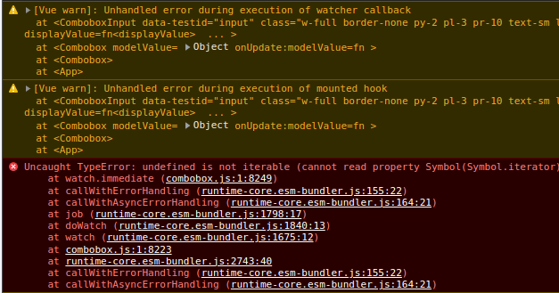

# How to reproduce ?

```shell
npm install
npm run dev
# OR
npm run test:run
```

Test result should be an exception:

```text
stderr | test/combobox.test.ts > combobox.vue > should render
[Vue warn]: Unhandled error during execution of watcher callback 
  at <ComboboxInput data-testid="input" class="w-full border-none py-2 pl-3 pr-10 text-sm leading-5 text-gray-900 focus:ring-0" displayValue=fn<displayValue>  ... > 
  at <Combobox modelValue= { id: 1, name: 'Wade Cooper' } onUpdate:modelValue=fn > 
  at <Combobox ref="VTU_COMPONENT" > 
  at <VTUROOT>
[Vue warn]: Unhandled error during execution of mounted hook 
  at <ComboboxInput data-testid="input" class="w-full border-none py-2 pl-3 pr-10 text-sm leading-5 text-gray-900 focus:ring-0" displayValue=fn<displayValue>  ... > 
  at <Combobox modelValue= { id: 1, name: 'Wade Cooper' } onUpdate:modelValue=fn > 
  at <Combobox ref="VTU_COMPONENT" > 
  at <VTUROOT>

 FAIL  test/combobox.test.ts > combobox.vue > should render
TypeError: undefined is not iterable (cannot read property Symbol(Symbol.iterator))
 ❯ q.immediate node_modules/@headlessui/vue/dist/components/combobox/combobox.js:1:8249
```

<details>

<summary>Screenshot</summary>



</details>

